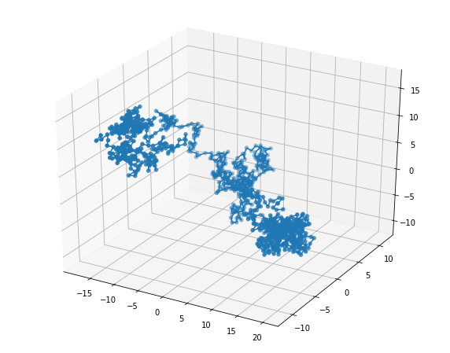

DiluteBrownianDynamics
======================

**Dilute Brownian Dynamics** simulation package written in Python, with
readability and extensibility as the main goals. It is primarily intended for
simulating toy models in polymer science.

**Brownian Dynamics** is a coarse-grained molecular dynamics paradigm used to
simulate macromolecules (or mesoscale objects such as nanoparticles) in a
viscous solvent. We are interested in long relaxation times and effective
mechanical and transport properties of these objects. Interactions with solvent
molecules which are occurring at a much shorter timescale are modelled by
random dissipative forces.

**Dilute** means that molecules are simulated individually, allowing simple data
structure (there is no *simulation box*) and parallel support. A variety of
molecule models are already implemented.

Installation
------------
In the target directory, clone this repository::

  git clone https://github.com/etiennerognin/DiluteBrownianDynamics.git

Then run the install script::

  pip install .

Usage
-----
General strategy
^^^^^^^^^^^^^^^^

The usual pipeline of molecular dynamics simulation applies:

1. Create a new molecule;

2. Perform relaxation step (no flow), discard data;

3. Perform simulation of interest (for example with an external flow field);

4. Export and analyse data. Some models can also be exported in ``vtk`` format
   which third party software such as Paraview_ can display and animate.

.. _Paraview: https://www.paraview.org/

These steps can be run in parallel for an ensemble of molecules.

Examples
^^^^^^^^
See the Jupyter notebooks in the ``/examples`` folder.

Developing new models
---------------------
A straightforward approach is to copy and modify an existing model in the
``/dilutebrowniandynamics/molecules`` folder. A model is a Python class which
in addition to constructors should provide at least three methods:

1. ``solve`` solve tensions and other forces given flow field and constraints.

2. ``measure`` compute and return in a Python dictionary what needs to be
   recorded at each time step (for example the moment of forces for the stress
   tensor estimator).

3. ``evolve`` evolve the system to the next step given the forces and flow field,
   and draw new random forces.

The main simulation loop will concatenate each measured observable into a
dictionary of time series. Then if an ensemble of molecules is simulated,
average and standard deviation of these series with respect to the ensemble are
computed. In this way there is full flexibility towards what each model should
compute and record.

Note on performance
-------------------
We can argue that having each molecule as a class instance is quite inefficient
for very simple models such as dumbbells. However, one of the main goals of this
package is to be easy to customise. Therefore this design seems to be a good
compromise. As models grow more complex, the overhead associated with object
instantiations and method calls should be negligible.

Todo
----
* Examples with internal hydrodynamic interactions.

Related packages
----------------

BDpack_
  Brownain dynamics in Fortran.

QPolymer_
  Qt-based GUI for polymer dynamics.

.. _BDpack: http://amir-saadat.github.io/BDpack
.. _QPolymer: https://sourceforge.net/projects/qpolymer

References
----------
1. E. Rognin, N. Willis-Fox, T. A. Aljohani, R. Daly,
   *A multiscale model for the rupture of linear polymers in strong flows.*
   Journal of Fluid Mechanics 848, 722–742 (2018).
